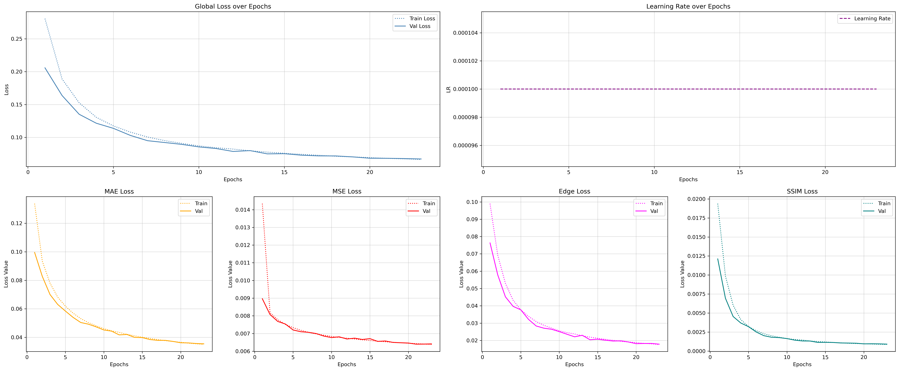
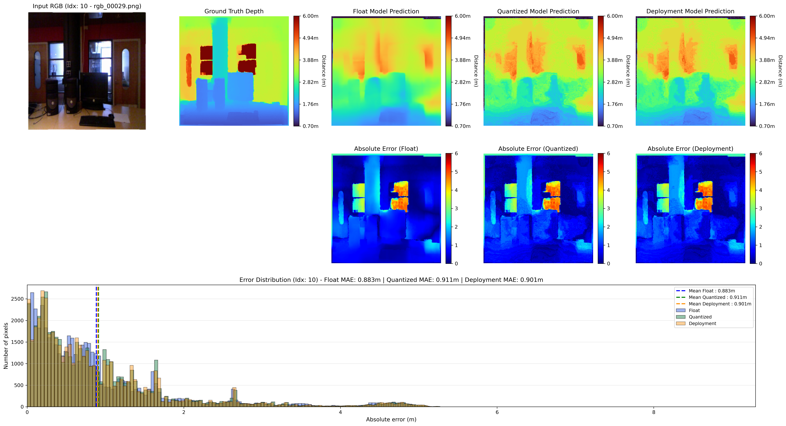

# KV260 MDE UNET


A project to train, quantize, compile, and deploy a UNet model for depth estimation on an AMD Xilinx Kria KV260 MPSoC. It is mainly intended for people doing research in the UMons Laboratory. This project relies heavily on previous work done in the laboratory by Nicolás Urbano Pintos (UTN FRH / CITEDEF) and Monal Patel Rakeshbhai (UMONS): https://github.com/nurbano/mde-unet-kv260

A project to train, quantize, compile and deploy a UNet model for depth estimation on an AND Xilinx Kria KV260 MPSoC. It is mainly meant for people doing reasearch in the UMons Laboratory. This project rely heavily on previous work done in the laboratory by Nicolás Urbano Pintos (UTN FRH /CITEDEF) and Monal Patel Rakeshbhai (UMONS): https://github.com/nurbano/mde-unet-kv260

## Table of Contents

- [About](#about)
- [Requirements](#requirements)
- [Installation](#installation)
- [Usage](#usage)
- [Project Structure](#project-structure)
- [Configuration](#configuration)
- [License](#license)


## About

This project is an internship research project and is part of UMons's research on edge-computing vision algorithms. The goal is to allow easy deployment of a depth estimation model on a hardware target (AMD Xilinx Kria KV260). The project mainly consists of Python scripts. It was made to target KV260 boards running PetaLinux 2021.1 and Ubuntu 22.04.4, and uses DPU IPs loaded onto the KV260. The project is easier to use on a Linux host machine. The dataset used is an NYU Depth V2 split found on Kaggle: https://www.kaggle.com/datasets/awsaf49/nyuv2-official-split-dataset

## Requirements

These are the versions used for this project. Compatibility with other versions has not been verified:

- Docker version 29.6.2
- Conda 25.11.1

## Installation

`[vitis-ai-version]` should be chosen according to the Vitis-AI version on the KV260. We used version `1.4.1.978` for PetaLinux 2021.1 and `2.5` for Ubuntu 22.04.4. If you are using a different version, you will most likely encounter problems at the compilation step that require modifications to `./compile.sh`.

`[dataset-directory]` should be the path to the dataset.

`[python-version]` should be the Python version used for training the model (done outside the Vitis-AI docker environment). We used `3.11`.

`[configuration-file]` should be a `.yaml` file following the model of `./configs/default.yaml` (`default.yaml` can be used and modified directly).

> **Important:** when using it in Vitis-AI, don't forget to update the Vitis-AI version parameter in the configuration file.

```bash
# Clone the repository
git clone https://github.com/madosaro/depth_estimation_kv260.git
cd depth_estimation_kv260

# Pull the Vitis-AI Docker image
docker pull xilinx/vitis-ai:[vitis-ai-version]

# On Linux, an alias can be created for easier use of the Vitis-AI Docker
cat >> ~/.bashrc << 'EOF'
alias vitisai='docker run -it --rm --net=host \
  -v "$(pwd)":/workspace \
  -v [dataset-directory]:/workspace/dataset/ \
  -w /workspace \
  xilinx/[vitis-ai-version]'
EOF
source ~/.bashrc

# The Vitis-AI Docker can then be launched by typing
vitisai

# Set up the conda environment
conda create --name myenv python=[python-version]
conda activate myenv

# Install python dependencies
pip install -r requirements.txt
```

## Usage

Parameters can be set in the `./configs` config files and are then used across the different commands.

```bash
# Train a model (outside the Vitis-AI docker, to use the GPU) -> outputs a training report
python3 train.py --config ./configs/[configuration-file]

# Quantize a model (must be launched inside the Vitis-AI docker)
python3 quantization.py --config ./configs/[configuration-file]

# Evaluate the float, quantized, and deployed (if data has been collected) models
# (must be launched inside the Vitis-AI docker)
python3 evaluate.py --config ./configs/[configuration-file]

# Generate depth map predictions with the float, quantized, and deployed
# (if data has been collected) models (must be launched inside the Vitis-AI docker)
python3 predict.py --config ./configs/[configuration-file]
```





To use the model on the Kria board, transfer `./kria_petalinux` or `./kria_ubuntu`, as well as the `./test` split of the dataset containing the image pairs and data used for testing.

You can then set up the DPU — we used `kv260-dpu-benchmark` for PetaLinux and `kv260-benchmark-b4096` for Ubuntu. You can check the DPU's compatibility by comparing the target in the `./arch_*.json` file used to compile the model against the output of the `xdputil query` command while a DPU is loaded.

```bash
# List all DPUs available on the KV260
sudo xmutil listapps

# Unload the currently loaded DPU
sudo xmutil unloadapp

# Load a DPU
sudo xmutil loadapp [dpu-name]

# Check the DPU currently loaded
sudo xdputil query
```

## Project Structure

```
DEPTH_ESTIMATION_KV260/
├── __pycache__/
├── .ipynb_checkpoints/
├── .vscode/
├── configs/
├── dataset/
├── ignore/
│   └── patate
├── kria_petalinux/
├── kria_ubuntu/
├── models/
│   └── MDE_UNET/
│       ├── build_1.4/
│       ├── build_2.5/
│       ├── checkpoints/
│       ├── outputs/
│       ├── MDE_UNET_history.json
│       ├── MDE_UNET.pth
│       └── TEST/
├── src/
│   ├── __pycache__/
│   ├── data/
│   ├── evaluation/
│   ├── losses/
│   ├── models/
│   ├── quantization/
│   ├── training/
│   ├── __init__.py
│   └── config.py
├── .gitignore
├── arch_1.4.json
├── arch_2.5.json
├── compile.sh
├── evaluate.py
├── predict.py
├── quantization.py
├── README.md
├── requirements.txt
└── train.py
```

## Configuration

All run parameters (dataset paths, model settings, Vitis-AI version, training hyperparameters, etc.) are defined in `.yaml` files under `./configs`. Use `./configs/default.yaml` as a starting template and create additional configuration files as needed for different experiments or deployment targets.


## License

This project is licensed under the MIT License — see the [LICENSE](LICENSE) file for details.

